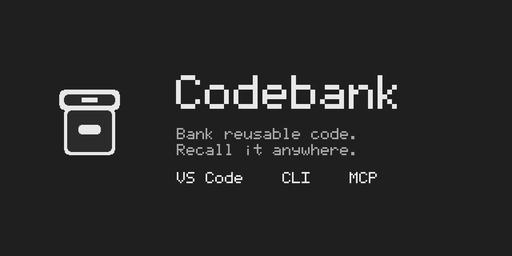

# Codebank

Codebank is a local-first VS Code extension, CLI, and MCP server that banks reusable code and recalls it in any project. Entries are plain files under `~/.codebank/`. Nothing is written into a project until you accept it.

The repository is public and licensed under MIT. Implementation follows `spec/CODEBANK-SPEC.md`, milestones M1 through M4, each shippable on its own.

## Getting started

Open the Codebank walkthrough in VS Code. It is enough for a first insert:

1. Run **Codebank: Scan This Machine**. Matches land in the Inbox and no project file is changed.
2. Accept three candidates.
3. In chat, type `#codebank` and what you need, then insert the card.

## Three steps

1. Select a function and run **Codebank: Deposit Selection**.
2. Run **Codebank: Search** and pick a result.
3. Insert it. Codebank writes the files and can type an install command into a terminal without running it.

From a terminal, the same bank is `codebank add`, `codebank search`, and `codebank get`. `codebank mine` looks through local repositories and leaves candidates in the inbox until you accept one. `codebank mcp` speaks the agent protocol on standard input.

An insert keeps a marker so a later version shows up under Updates. External mode stores that link and does not add marker text. Taking an update is one editor edit, so one undo puts the old copy back. A conflict is never applied on its own.

Codebank does not send telemetry and does not open its own network connections. If you allow a deposit draft, the selected code goes to the editor's language model, which may be remote. The statement is [packages/vscode/PRIVACY.md](packages/vscode/PRIVACY.md). Settings are reviewed in the extension manifest under `codebank.*`.

## Repository rules

`main` is locked. Changes merge only through pull requests, CI must pass, and force-pushes and branch deletion are blocked. Administrators do not bypass those rules.

Only collaborators with write access can open pull requests. The maintainer account is [bobrowsse-tech](https://github.com/bobrowsse-tech). Add another maintainer from the repository collaborators settings; everyone else can clone and use the code, and cannot open a pull request.

## Publish

Publishing a GitHub Release tagged `vX.Y.Z` (the same version as `packages/vscode/package.json`) runs [`.github/workflows/publish.yml`](.github/workflows/publish.yml):

1. Test, package the `.vsix`, and attach it to the release.
2. Publish that package to the Visual Studio Marketplace (`VSCE_PAT`). Open VSX uses trusted publishing from this workflow, for `bobrowsse-tech/codebank` and `publish.yml`.
3. Publish the CLI to npm only when `NPM_TOKEN` is set and the package name is scoped. The unscoped name `codebank` is already taken.

A manual run of the same workflow publishes Open VSX and npm, and leaves the Marketplace step for a release.

## Sponsor

[Sponsor the work](https://github.com/sponsors/bobrowsse-tech) if Codebank saves you time.

## Contents

- `spec/CODEBANK-SPEC.md` is the build specification.
- `ui/png/` has screenshots of every screen (Main is the S1 first-run scan, then S2 to S8, and Tokens). `ui/html/` is the same screens as static HTML. Colors map to VS Code theme variables. Never hard-code hex values in the extension.
- `ui/source/` has the original design files. They need the design tool's runtime, so use `ui/html/` instead.
